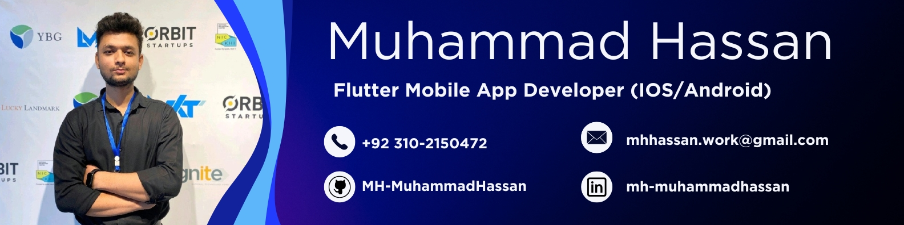
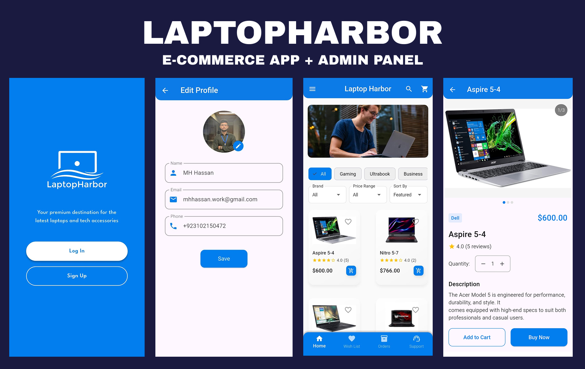
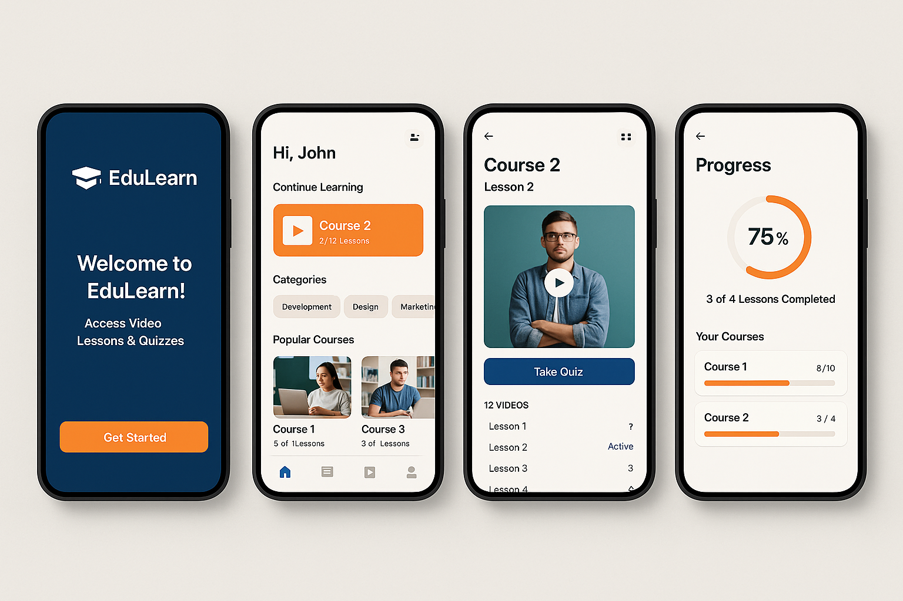
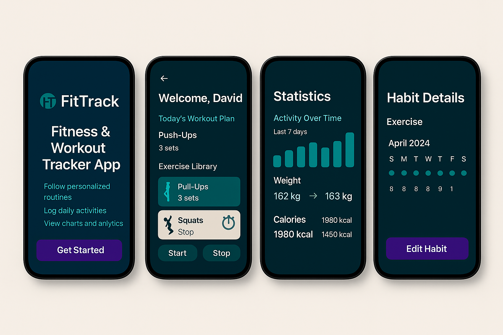
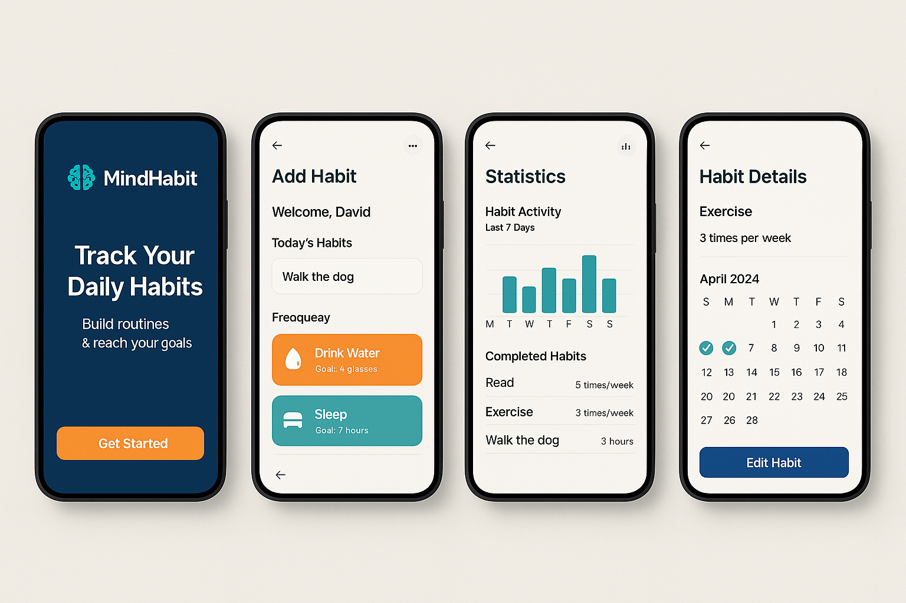

# 👨‍💻 Muhammad Hassan's Flutter Portfolio

Welcome to my personal Flutter portfolio showcasing four high-performance mobile apps built with Flutter and Firebase, REST APIs, and clean architecture. Each project demonstrates modern UI/UX design, responsive layouts, and robust features to attract potential clients or employers.

---

# 💻 LaptopHarbor – E-Commerce App (Flutter + Firebase)

LaptopHarbor is a modern, scalable, and user-friendly mobile e-commerce application built using **Flutter** and **Firebase**. Designed for seamless shopping experiences, this app supports both **user and admin roles** with distinct dashboards and functionality.

### 📱 Application Features
- 🌗 Light & Dark Mode  
- 🌍 Multi-language ready (default: English)  
- 🔐 Secure Authentication (Login/Sign Up), Google Sign-In, Password Reset  
- 🎉 Onboarding screens  
- 🛍️ Category-wise shopping, search functionality  
- 🧠 Advanced filtering (name, category, price)  
- ❤️ Wishlist functionality  
- 👤 Account management  
- 🛒 Add to cart, place orders  
- 📝 Detailed product views with ratings/reviews  
- 💳 Stripe Payment Integration (Coming Soon)  
- 🔔 Push Notifications (Upcoming)  
- 💾 Persistent login & theme (Shared Preferences)  
- 📊 Admin Panel:
  - Manage products, categories, orders, and delivery pricing  
  - Manage banners  
  - Track user orders and wishlists  

### 🔍 Project Description
- User-friendly shopping experience  
- Real-time order tracking  
- Powerful admin tools  
- Secure transactions  
- Clean architecture

### ✅ Functional Requirements
- 👤 Auth (Sign up/login/reset)  
- 🧑‍💼 Profile management  
- 🖥️ Product listings and filters  
- 📄 Product reviews  
- 🛒 Cart and checkout  
- 🚚 Order tracking  
- 🔍 Search functionality  
- 💖 Wishlist  
- 📞 Support form

### 🧰 Tech Stack
- **Frontend:** Flutter (Dart)  
- **Backend:** Firebase Auth, Firestore  
- **State Management:** Provider  
- **Storage:** Shared Preferences  
- **Other:** Firebase Core, Navigation 2.0, Clean Architecture

🔗 **GitHub:** [LaptopHarbor Repo](https://github.com/MH-MuhammadHassan/LaptopHarbor-E-Commerce-App)

---

# 📚 EduLearn – E-Learning Mobile App (Flutter + Firebase)

A cross-platform mobile app built using **Flutter**, designed for students to access online courses, take quizzes, and track their learning progress. Includes Firebase integration for authentication and real-time data handling.

---

### 📱 Application Features
- 🔐 User registration and login via **Firebase Authentication**  
- 🎥 Course video player with lesson tracking  
- 📝 Quiz module with real-time scoring  
- 📈 Progress tracker with weekly insights  
- 🧾 Certificate generation after course completion  
- 🌙 Light and dark mode switch  
- 📱 Fully responsive UI for all screen sizes

---

### 🧾 Project Description
EduLearn is focused on delivering a smooth, intuitive learning experience on mobile devices. The app enables users to explore multiple subjects, take interactive quizzes, and earn digital certificates.

---

### ✅ Functional Requirements
- 🔐 Firebase Auth integration (Sign up / Login / Logout)  
- 📂 Course library with video support  
- 🧠 Quiz system with scoring logic  
- 📊 Track user progress and learning stats  
- 🧾 Generate downloadable certificates  
- 🌙 Theme toggle (light/dark)

---

### 🧰 Tech Stack
- **Framework:** Flutter (Dart)  
- **Backend/Database:** Firebase  
- **API Integration:** REST APIs for course and quiz content  
- **Design & Prototyping:** Figma  
- **Authentication:** Firebase Auth  
- **State Management:** `setState` / FutureBuilder  
- **Storage:** Firebase Cloud Firestore  
- **Media:** Video Player package

# 🏋️‍♂️ FitTrack – Fitness & Workout Tracker App (Flutter + Firebase)

A cross-platform mobile app built using **Flutter**, designed to help users stay consistent with their fitness goals through personalized workouts, daily logging, and detailed progress analytics.

---

### 📱 Application Features
- 🔐 User authentication & profile management  
- 🏃 Personalized daily workout plans  
- 📚 Built-in exercise library  
- 📈 Graphs for tracking weight & calorie burn  
- ⏱️ Stopwatch & timer for workouts  
- 🔔 Push notifications for reminders & streaks  

---

### 🧾 Project Description
FitTrack enables users to follow structured workout routines, track their physical activity, and visualize their progress over time. With integrated timers and reminders, the app promotes daily engagement and fitness habit formation.

---

### ✅ Functional Requirements
- 🧍 User sign-in/sign-up with Firebase  
- 📆 Workout plans by day or week  
- 📊 Charts for progress visualization (Chart.js)  
- 🕒 In-app workout stopwatch and timer  
- 🔔 Notifications via Firebase Cloud Messaging  
- 📁 Backend integration with REST APIs

---

### 🧰 Tech Stack
- **Framework:** Flutter (Dart)  
- **Backend:** Firebase Authentication, Cloud Messaging  
- **Charts:** Chart.js  
- **UI State Management:** `setState`, FutureBuilder  
- **Design:** Prototyped using Figma  
- **API:** REST API integration for workout data

---

# 📰 Flutter News App – Live News with Filters (Flutter + REST API)

A real-time news app using **Flutter** and **REST APIs**. Features include a clean UI, optimized image loading, and filter systems by category/source.

### 📱 Application Features
- 🌟 Splash screen with **Flutter Spinkit**  
- 📰 Live news with images, source & timestamps  
- 🧭 Filter by category/source (BBC, Al Jazeera, Axios, etc.)  
- 🖼️ CachedNetworkImage for image loading  
- 🧩 Responsive layout  
- 🕒 Localized date/time with `intl`  
- 🎨 Custom themes with Google Fonts  
- 💾 Shared Preferences for theme persistence (Upcoming)

### 🔍 Project Description
- Browse breaking news  
- Explore by topic/source  
- Learn REST API integration  
- Responsive UI design

### ✅ Functional Requirements
- 🔐 Splash screen with animation  
- 📰 Article feed with meta info  
- 🗂️ Category/provider filters  
- 🔍 Search & article details (Upcoming)  
- ⚙️ Theme settings (Planned)

### 🧰 Tech Stack
- **Flutter (Dart)**  
- **API Integration:** `http`  
- **Image:** CachedNetworkImage  
- **Date/Time:** `intl`  
- **Typography:** Google Fonts  
- **State:** `setState`, FutureBuilder  
- **Persistence:** Shared Preferences (planned)

🔗 **GitHub:** [Flutter News App Repo](https://github.com/MH-MuhammadHassan/flutter_news_app)

---

# 🌦️ Weather App (Flutter + OpenWeatherMap API)

A clean, responsive weather app using **Flutter** and the **OpenWeatherMap API**, showing live weather, forecasts, and modular components.

### 🚀 Features
- 🔁 Live data via `http`  
- 🌡️ Current weather:
  - Temperature, condition, humidity, wind, pressure  
- 🕐 Hourly forecast  
- 🧱 Reusable widgets  
- 🌍 Ready for multiple locations  
- 🕓 Time formatting with `intl`  
- 🧮 Light calculations using `math_expressions`  
- 💾 Persistent state with Shared Preferences

### 🧰 Tech Stack
- **Framework:** Flutter  
- **Language:** Dart  
- **API:** OpenWeatherMap  
- **Packages:**  
  - [`http`](https://pub.dev/packages/http)  
  - [`intl`](https://pub.dev/packages/intl)  
  - [`math_expressions`](https://pub.dev/packages/math_expressions)  
  - [`shared_preferences`](https://pub.dev/packages/shared_preferences)

🔗 **GitHub:** [Weather App Repo](https://github.com/MH-MuhammadHassan/weather-app)

---

# 🧠 MindHabit – Daily Habit Tracker App (Flutter + Firebase)

A minimalist mobile app built using **Flutter**, designed to help users build strong habits through daily tracking, visual streaks, and timely reminders.

---

### 📱 Application Features
- ➕ Add, edit, and delete habits  
- 📅 Calendar view for visualizing streaks  
- 🔔 Push notifications for daily habit reminders  
- 🎯 Streak-based motivation system  
- 🌙 Clean and intuitive UI with light/dark mode  
- 📱 Fully responsive and lightweight design

---

### 🧾 Project Description
MindHabit is designed for simplicity and consistency. It allows users to focus on building better habits through daily check-ins and progress tracking. The app is distraction-free, lightweight, and perfect for personal productivity.

---

### ✅ Functional Requirements
- 🧠 Add and manage multiple daily habits  
- 📆 Calendar integration for streak tracking  
- 🔔 Notifications using Firebase Cloud Messaging  
- 💾 Local storage using SharedPreferences  
- 🌙 Theme toggle support (optional/coming soon)

---

### 🧰 Tech Stack
- **Framework:** Flutter (Dart)  
- **Local Storage:** SharedPreferences  
- **Notifications:** Firebase Cloud Messaging  
- **UI State:** `setState`, FutureBuilder  
- **Design:** Custom UI with minimalistic UX principles  
- **Tooling:** Figma for UI prototyping

---

# 🧮 Flutter Calculator App

A minimal calculator app built with **Flutter**, using `math_expressions`. Responsive, accurate, and ideal for basic arithmetic and UI learning.

### 📱 Features
- ➕ Basic operations: +, −, ×, ÷  
- 🧹 AC and DEL functionality  
- 🧠 Expression parsing via `math_expressions`  
- 📱 Responsive layout  
- 🧩 Custom button widgets

### 🔍 Description
- Clean minimal UI  
- Accurate expression evaluation  
- Ideal for Flutter beginners  
- Extendable for advanced math

### ✅ Functional Requirements
- 🔢 Calculator engine with parsing  
- 🧼 Clear/delete controls  
- 🎨 Button grid layout

### 🧰 Tech Stack
- **Framework:** Flutter  
- **Math Engine:** `math_expressions`  
- **UI Toolkit:** Custom Widgets + Material  
- **State Management:** `setState`

🔗 **GitHub:** [Calculator App Repo](https://github.com/MH-MuhammadHassan/Flutter-Calculator-App)

---

## 👨‍💻 Author

**Muhammad Hassan**  
[LinkedIn](https://www.linkedin.com/in/mh-muhammadhassan/)

---

## 🤝 Contributions

Contributions are welcome!  
Feel free to open issues or submit pull requests to enhance the project.

---

## 📞 Contact Me

I'm open to freelance opportunities, collaborations, or full-time roles.

**Muhammad Hassan**  
📧 [LinkedIn Profile](https://www.linkedin.com/in/mh-muhammadhassan/)  
📍 Location: Pakistan | 🌍 Remote Available
