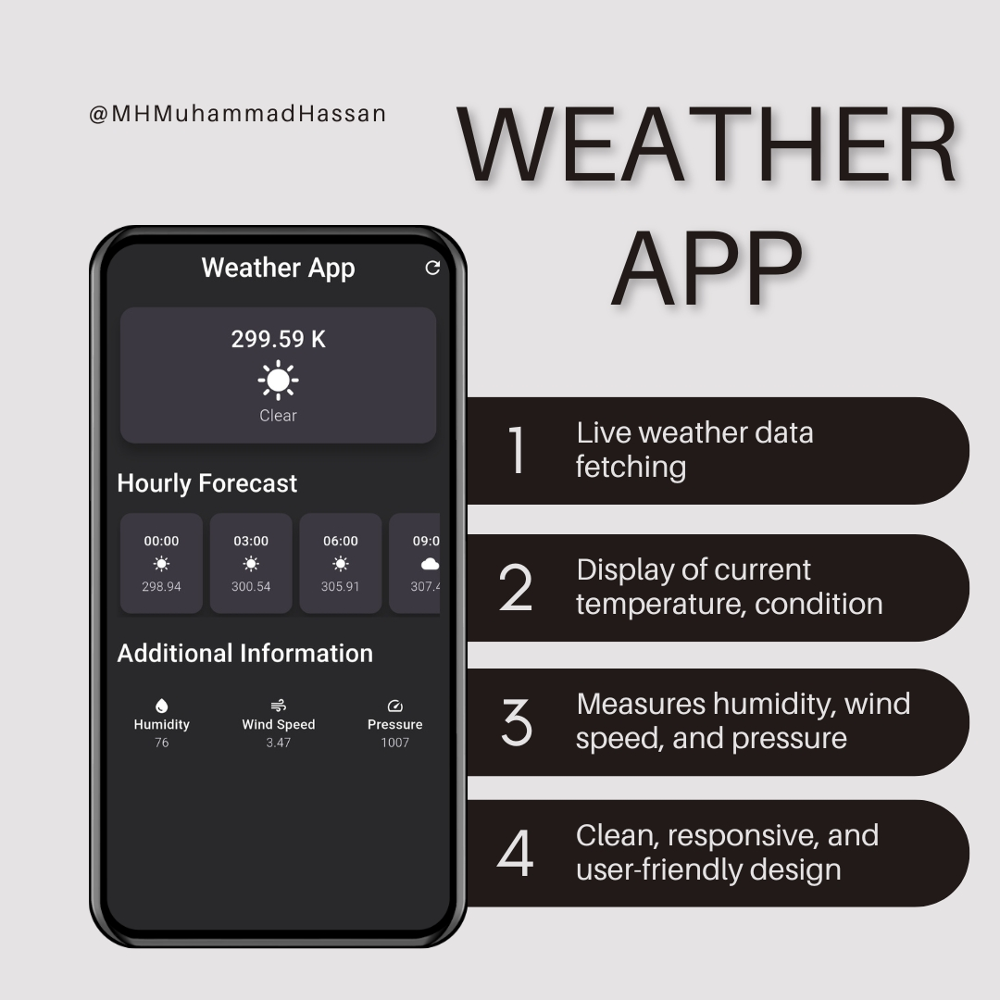
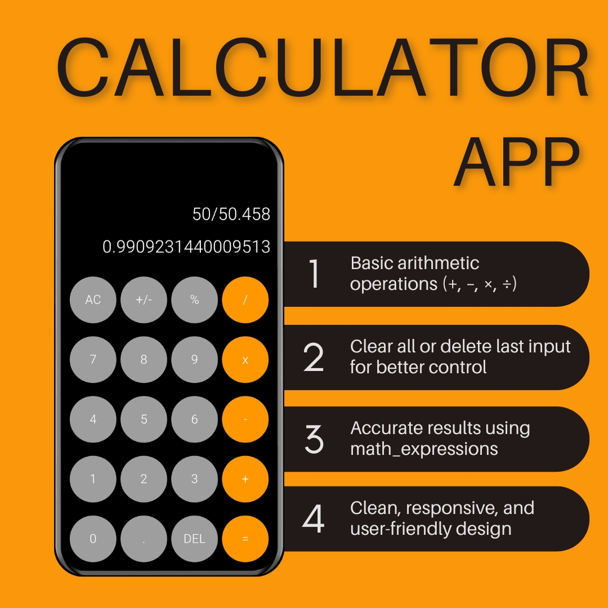

# 👨‍💻 Muhammad Hassan's Flutter Portfolio

Welcome to my personal Flutter portfolio showcasing four high-performance mobile apps built with Flutter and Firebase, REST APIs, and clean architecture. Each project demonstrates modern UI/UX design, responsive layouts, and robust features to attract potential clients or employers.

# 💻 LaptopHarbor – E-Commerce App (Flutter + Firebase)

LaptopHarbor is a modern, scalable, and user-friendly mobile e-commerce application built using **Flutter** and **Firebase**. Designed for seamless shopping experiences, this app supports both **user and admin roles** with distinct dashboards and functionality.

---

## 📱 Application Features

- 🌗 Light & Dark Mode
- 🌍 Available in English & easily extendable to new languages
- 🔐 Secure Authentication (Login/Sign Up), Google SignIn, Password Reset
- 🎉 Beautiful onboarding screens
- 🛍️ Shop by category, search by name
- 🧠 Filter products by name, category, and price (low-high)
- ❤️ Save products to Wishlist
- 👤 Manage account details & change password
- 🛒 Add to cart, order products
- 📝 Product pages with ratings, reviews, and detailed descriptions
- 💳 Stripe Payment Integration (Coming Soon)
- 📱 Responsive UI with adaptive layout (Dark/Light)
- 🔔 Push Notifications (Upcoming)
- 💾 Persistent login & theme using Shared Preferences
- 🗂️ Firebase-powered backend
- 📊 Admin Panel:
  - Add/Update/Delete products & categories
  - Manage banners, orders, and delivery pricing
  - Track user wishlists & orders

---

## 🔍 Project Description

The **LaptopHarbor** app is crafted to offer users a seamless and efficient platform to browse, compare, and purchase laptops and accessories. With an intuitive interface and rich features, it simplifies the shopping experience, offering:

- **User-friendly browsing**
- **Comprehensive product info**
- **Smart search and filtering**
- **Secure transactions**
- **Real-time order tracking**
- **Admin tools for product and order management**

---

## ✅ Functional Requirements

### 👤 User Authentication
- Sign up, login, and reset password
- Secure session management with Shared Preferences

### 🧑‍💼 User Profile & Settings
- Update profile, change password, manage contact info

### 🖥️ Product Listings
- View by category, brand, price, and specs
- Smart filtering and sorting

### 📄 Product Details & Reviews
- Detailed descriptions, high-res images, user ratings
- Review and rate products

### 🛒 Shopping Cart
- Add, edit, and remove items
- View cart summary and totals

### 🧾 Checkout & Order
- Secure checkout with billing/shipping info
- Email confirmations and order summaries

### 🚚 Order Tracking
- Track orders in real-time with notifications

### 🔍 Search
- Search laptops or accessories by name or brand
- Apply filters for better results

### 💖 Wish List
- Add and manage favorites from user profile

### 📞 Feedback & Support
- In-app customer support contact form

---

## 🧰 Tech Stack

- **Frontend:** Flutter (Dart)
- **Backend:** Firebase Auth, Firestore
- **State Management:** Provider
- **Storage:** Shared Preferences for session and theme persistence
- **Other:** Firebase Core, Navigation 2.0, Clean Architecture

---

# 📰 Flutter News App – Live News with Filters (Flutter + REST API)

The **Flutter News App** is a sleek, real-time news reader app built using **Flutter** and **REST APIs**. It offers a modern interface, category-based filtering, optimized image loading, and smooth performance. Ideal for those learning API integration, UI design, and Flutter development best practices.

---

## 📱 Application Features

- 🌟 Beautiful splash screen with **Flutter Spinkit**
- 📰 Live headlines with **images, titles, sources, and publish dates**
- 🧭 Filter news by **category** (business, technology, etc.) and **source** (BBC, Al Jazeera, ARY, Axios)
- 🖼️ Optimized image loading using **CachedNetworkImage**
- 🧩 Responsive layout with clean, modern UI
- 🕒 Localized time formatting with `intl`
- 🎨 Custom theming using **Google Fonts**
- 💾 Persistent theme and session support using **Shared Preferences** (Upcoming)

---

## 🔍 Project Description

The **Flutter News App** delivers a smooth and intuitive experience for browsing the latest news from various credible sources. Built with RESTful API integration and modern UI/UX design practices, it helps users:

- Stay updated with breaking headlines
- Filter and explore topics of interest
- Enjoy a polished, responsive mobile experience
- Learn about API handling and clean Flutter architecture

---

## ✅ Functional Requirements

### 🔐 Splash & Loading
- Animated splash screen using **Spinkit**
- Loader shown while fetching data

### 📰 News Listing
- Browse articles with full image and meta info
- Scrollable feed with automatic updates

### 🗂️ Filtering System
- Filter articles by **category** and **news provider**
- Multiple predefined filters

### 🔍 Search & Details
- In-app search (Upcoming)
- Detailed article views (Coming Soon)

### ⚙️ Settings
- Persistent dark/light theme support using Shared Preferences (Planned)

---

## 🧰 Tech Stack

- **Frontend:** Flutter (Dart)
- **API Integration:** REST API using `http`
- **Image Optimization:** CachedNetworkImage
- **Date Formatting:** `intl` package
- **Loaders:** Flutter Spinkit
- **Typography:** Google Fonts
- **State Management:** setState / FutureBuilder (simple state)
- **Session/Theme:** Shared Preferences (planned)

---

# 🌦️ Weather App - Flutter

A beautifully crafted Weather App built with **Flutter**, delivering real-time weather updates using the [OpenWeatherMap API](https://openweathermap.org/). The app demonstrates responsive UI design, external API integration, and custom widget architecture for seamless user experience.

---

## 🚀 Features

- 🔁 Real-time weather data fetching using `http`
- 🌡️ Current weather display:
  - Temperature
  - Weather condition
  - Humidity
  - Wind speed
  - Atmospheric pressure
- 🕐 Hourly weather forecast
- 🎨 Sleek, clean, and fully responsive user interface
- 🧱 Modular architecture with custom reusable widgets
- 🌍 Multi-location support ready
- 🕓 Time formatting using `intl`
- 🧮 Lightweight calculations using `math_expressions`
- 💾 State persistence using **Shared Preferences**

---

## 🧰 Tech Stack

- **Framework:** Flutter
- **Language:** Dart
- **API:** OpenWeatherMap
- **Packages:**
  - [`http`](https://pub.dev/packages/http)
  - [`intl`](https://pub.dev/packages/intl)
  - [`math_expressions`](https://pub.dev/packages/math_expressions)
  - [`shared_preferences`](https://pub.dev/packages/shared_preferences)

---

# 🧮 Flutter Calculator App

The **Flutter Calculator App** is a sleek, minimalistic calculator built using **Flutter** and the `math_expressions` package. Designed for responsiveness and accuracy, it supports core arithmetic operations with a clean, intuitive user interface.

---

## 📱 Application Features

- ➕ Basic operations: **Addition, Subtraction, Multiplication, Division**
- 🧹 **AC (All Clear)** and **DEL (Delete)** buttons for easy expression handling
- 🧠 Expression evaluation using **math_expressions**
- 📱 Responsive design for various screen sizes and orientations
- 🧩 Custom button widgets for consistency and clarity

---

## 🔍 Project Description

The **Flutter Calculator App** aims to provide users with a smooth, responsive, and functional experience for solving basic mathematical expressions. Ideal for Flutter beginners or those looking to understand widget layouts and state management fundamentals.

- Minimal UI with elegant interaction
- Accurate result parsing and evaluation
- Easily extendable for scientific functions or advanced math

---

## ✅ Functional Requirements

### 🔢 Calculator Engine
- Input numbers and operations
- Evaluate full expressions using `Parser` from `math_expressions`

### 🧼 UI Controls
- All Clear resets the input and result
- Delete removes the last character
- Real-time display of input and output

### 🎨 Interface
- Button grid UI with responsive layout
- Custom button components for flexibility

---

## 🧰 Tech Stack

- **Framework:** Flutter (Dart)
- **Math Engine:** `math_expressions` package
- **UI Toolkit:** Custom Widgets + Material Components
- **State Management:** `setState()` based for simplicity

---

